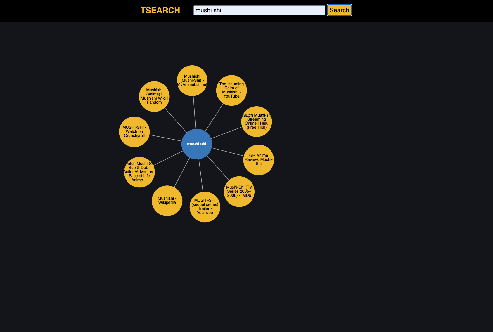

commands

    npm install
    
    npm run start
    
    mpm run build

API / Technology

        Google Custom Search API
        
        d3
            
        express
        
        webpack
        
        
Tsearch is a visual search engine. Search anything and watch the results appear before your eyes with beautiful physics that make the whole structure come together.
the inspiration for tsearch came from the Idea of being able to see search results as nodes of a search term.
I think that when people can see the results of a search or query in a hierarchal structure it becomes easier to sift through all the data.

Click the nodes to travel to a website

